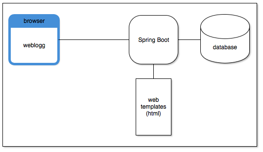

# Weblogg

Build a simple blog app using spring and database. This uses Thymeleaf and Bootstrap for the web pages it generates.
The overall architecture looks like this:

Uses web pages for it.

This db is currently Postgres. The Mysql config is slightly different.

to POST a post
http://localhost:8080/posts
// mime type application/json
// body:
{
"title": "Hello World2",
"description": "nothing else",
"content": "Howdy Everyone!"
}

to GET a list of posts
http://localhost:8080/posts?page=0&size=2&sort=createdAt,desc

to GET comments on a post
http://localhost:8080/posts/1/comments?page=0&size=3&sort=createdAt,desc

to POST a comment on a post
http://localhost:8080/posts/4/comments
// mime type application/json
// body:
{
"text": "astonishing and amazing as well!"
}
